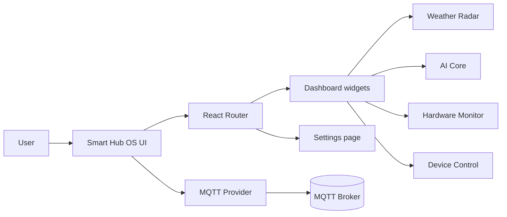

# Smart Hub OS

<p align="center">
  
</p>

<p align="center">
  
  
  
  
  
</p>

Smart Hub OS is a futuristic control dashboard for connected devices, live telemetry, weather awareness, and AI-assisted command entry. It is designed around a glassmorphism UI with motion-driven interactions, MQTT connectivity, and modular widgets that can be expanded into a larger home or lab control surface.

## Preview

The current visual direction uses a dark neon control-room theme with glass panels, animated gradients, and responsive dashboard cards.

<p align="center">
  
</p>

## What It Does

- Dashboard: a responsive home screen with Pomodoro, weather, hardware, AI core, and device control widgets.
- MQTT control: live broker connection state, command publishing, and topic subscription support.
- System settings: local configuration for MQTT, weather API, and AI provider credentials.
- Live telemetry: animated stats cards for CPU, RAM, WiFi strength, and temperature.
- Device actions: brightness control plus reboot, MQTT restart, OTA update, and factory reset commands.
- AI terminal: a command-style chat panel for simulating a local assistant flow.

## Tech Stack

- React 19
- TypeScript
- Vite
- Tailwind CSS v4
- Framer Motion
- MQTT.js
- React Router
- React Hot Toast
- Recharts
- Lucide React

## Architecture



## Project Structure

```text
src/
  components/
    Layout/        App shell, sidebar, topbar, glass panels
    Widgets/       Pomodoro, Weather, AI, Hardware, Device Control
  context/         Theme and MQTT providers
  hooks/           Clock hook used by the top bar
  pages/           Dashboard and Settings routes
  assets/          Hero image and static branding assets
```

## Getting Started

### Prerequisites

- Node.js 20 or newer
- npm 10 or newer

### Install

```bash
npm install
```

If PowerShell blocks npm scripts on Windows, run this once in an elevated or current-user PowerShell session:

```powershell
Set-ExecutionPolicy -ExecutionPolicy RemoteSigned -Scope CurrentUser
```

### Run Locally

```bash
npm run dev
```

### Build for Production

```bash
npm run build
```

### Preview the Build

```bash
npm run preview
```

### Lint

```bash
npm run lint
```

## Configuration

The app reads MQTT defaults from environment variables and allows per-user overrides through local storage.

Environment variables:

- `VITE_MQTT_HOST`
- `VITE_MQTT_PORT`
- `VITE_MQTT_USER`
- `VITE_MQTT_PASS`
- `VITE_DEVICE_ID`

Local storage keys:

- `mqtt_broker`
- `weather_api_key`
- `ai_provider`
- `ai_api_key`

## MQTT Topics

- Subscribed topic pattern: `myhome/smarthub_xyz/#`
- Command topic: `myhome/smarthub_xyz/cmd`

Example command payloads:

```json
{ "action": "set_brightness", "value": 50 }
```

```json
{ "action": "set_mode", "mode": "ai_face" }
```

## Notes

- The dashboard currently includes placeholder routes for Weather, AI, Hardware, and Analytics detail pages.
- The hero image is already included in the repository at `src/assets/hero.png` and is used above as the main preview.
- The UI is optimized for a dark glass-panel aesthetic and works best at desktop and tablet widths.

## Roadmap

- Add full detail pages for each sidebar module.
- Wire weather and AI integrations to live backend services.
- Expand analytics with charts and historical trend views.
- Add persistent device presets and workspace layouts.

## License

No license has been defined yet. Add one before publishing the repository publicly.
